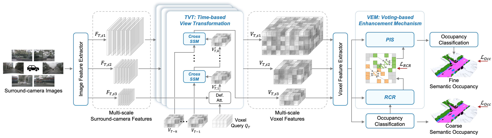

# CSV-Occ: Fusing Multi-frame Alignment for Occupancy Prediction with Temporal Cross State Space Model and Central Voting Mechanism

> Ziming Zhu1, Yu Zhu1,†, Jiahao Chen1, Xiaofeng Ling1, Huanlei Chen2, Lihua Sun1  
> 1 East China University of Science and Technology  
> 2 Shanghai Motor Vehicle Inspection Certification & Tech Innovation Center Co., Ltd.  
> † Corresponding Authors

## Abstract

Recently, predicting 3D semantic occupancy from images has become popular in self-driving 3D scene understanding. Voxel occupancy can describe fine-grained obstacle contours better than 3D object detection's bounding boxes, helping self-driving tasks. Our CSV-Occ method meets two challenges. First, we simplify temporal information fusion by extending the state space model, cutting computational complexity. Second, we help the model accurately vote for voxel-belonging instance centers to fix semantic ambiguity. Tests on Occ3D-nuScenes and nuScenes lidar data show our method excels in camera-based 3D occupancy prediction and lidar semantic segmentation. We think CSV-Occ benefits the self-driving community and industry.

## News
- `[2025-05-02]` Our CSV-Occ is accepted by ICML 2025!

- `[2025-03-28]` This Git repository has been created.

---